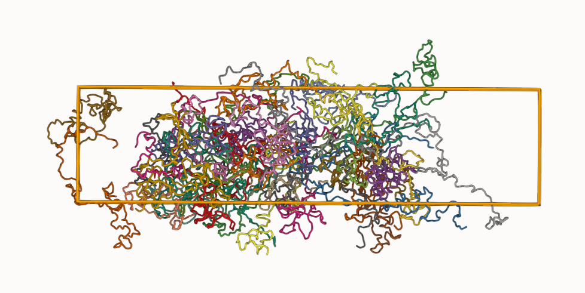
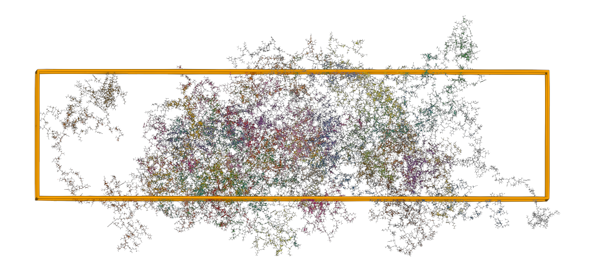
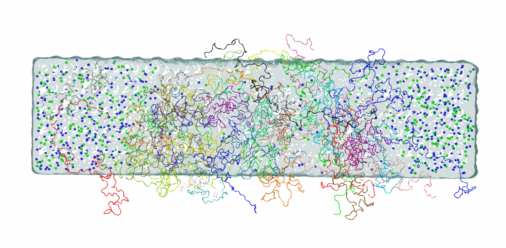

## Tutorial 1: FUS LC slab system

This tutorial reproduces a classic condensate setup from Reference [1]. The original study used the HPS force field, placed 40 monomers in a 10 × 10 × 40 box to form FUS LC and LAF1 RGG condensates, performed backmapping with PULCHRA, optimized with CAMPARI (implicit solvent MC in vacuum), and ran 2 μs atomistic simulations with Amber ff03ws.

2020 JPCB abstract figure:


Here we build a 10 × 10 × 40 system containing 40 FUS LC monomers using CondenSimAdapter. We use `calvados` for CG, `amber99sbws-stqp` for AA, and `cg2all` for backmapping.

## Step 0: Activate environment and set up directories

```bash
conda activate condensim
cd Tutorials/Tutorial_1_FUS_slab
mkdir run
cd run
adapter -h
```

A help message will be displayed, introducing CondenSimAdapter. From this, we can see that a typical workflow consists of the following steps:

### Typical workflow

| Step | Command | Description |
| --- | --- | --- |
| 1 | `adapter init my_project` | Initialize a new project |
| 2 | `adapter cg -f config.yaml` | Run coarse-grained simulation |
| 3 | `adapter backmap -f config.yaml` | Backmap to all-atom representation |
| 4 | `adapter minimize -i backmapped.pdb -f config.yaml` | Energy minimization and explicit solvation (optional) |

Installation: please refer to the main `README.md` for setup instructions.

## Step 1: Create the configuration file with `adapter init`

Based on the system we want to simulate, use `adapter init` to generate the YAML. This YAML is the core file for managing the full multiscale workflow and will be used throughout the entire multiscale simulation stage:

```bash
adapter init -h
adapter init -ff calvados --type idp -tp slab -n 40 -t 100 -b 10 10 40 -T 298 -I 0.15 --name FUS_LC
ls
# FUS_LC.yaml
```

Example `adapter init` output:

```text
============================================================
Configuration template created successfully!
============================================================

  File: FUS_LC.yaml
  System: FUS_LC
  Force field: calvados
  Topology: slab - Slab geometry with periodic boundaries in x, y and interfaces with dilute phase along z
  Box: [10.0, 10.0, 40.0] nm
  Temperature: 298.0 K
  Ionic: 0.15 M
  Time: 100.0 ns (10,000,000 steps)
  Components: 1 (IDP (requires FASTA file))
  Molecules per component: 40

  Next steps:
    1. Edit FUS_LC.yaml (especially fdomains for MDP components)
    2. Add your input files (FASTA/PDB) to 'input/' directory
    3. Run: adapter cg -f FUS_LC.yaml [options]
       (use 'adapter cg -h' to see available options)
```

The generated `FUS_LC.yaml` looks like this:

```yaml
# CG Simulation Configuration
# Generated by: adapter init
#
# Available CG force fields:
#   - calvados : CALVADOS (version auto-selected: CALVADOS2 for IDP-only, CALVADOS3 if MDP present)
#   - hps      : HPS-Urry model
#   - cocomo   : COCOMO2
#   - mpipi    : Mpipi-Recharged
#
# Geometry types:
#   - grid: Continuous dense phase with periodic boundaries in x, y, z
#   - slab: Periodic boundaries in x, y and interfaces with dilute phase along z
#   - droplet: Spherical droplet confined within radius r, surrounded by dilute phase

# System information
system_name: FUS_LC

# CG force field
force_field: calvados   # calvados | hps | cocomo | mpipi

# Environment parameters
box: [10.0, 10.0, 40.0]   # nm (x, y, z)
temperature: 298.0         # Kelvin
ionic: 0.15                # Molar (ionic strength)

# Topology type:
#   - grid: Continuous dense phase with periodic boundaries in x, y, z.
#   - droplet: Spherical droplet confined within radius r, surrounded by dilute phase
#   - slab: Geometry with periodic boundaries in x, y and interfaces with dilute phase along z.
topol: slab

# CG simulation parameters
simulation:
  steps: 10000000   # 100.0 ns (1 step = 10 fs)
  wfreq: 5000        # write frequency - save per 50 ps

# Topology entanglement check (runs on final.pdb after MD)
# Detects chain threading artifacts using Z-code Primitive Path Analysis.
# Set to false to skip (useful for quick test runs).
check_entanglement: true

# Component definitions
components:
  - name: protein_A
    type: IDP          # IDP or MDP
    nmol: 40           # number of molecules (can be adjusted per component)
    ffasta: input/protein_A.fasta
```

### Update the component section

Edit `components` so the `name` matches the FASTA header (the `>` line):

```yaml
components:
  - name: FUS_LC
    type: IDP          # IDP or MDP
    nmol: 40           # number of molecules (can be adjusted per component)
    ffasta: ../input/sequences.fasta
```

The `sequences.fasta` file is provided with this tutorial, with the following content:

```text
>FUS_LC
MASNDYTQQATQSYGAYPTQPGQGYSQQSSQPYGQQSYSGYSQSTDTSGYGQSSYSSYGQSQNTGYGTQSTPQGYGSTGGYGSSQSSQSSYGQQSSYPGYGQQPAPSSTSGSYGSSSQSSSYGQPQSGSYSQQPSYGGQQQSYGQQQSYNPPQGYGQQNQYNS
```


## Step 2: Run CG simulation with `adapter cg`

```bash
adapter cg -f FUS_LC.yaml
```

The terminal will display real-time simulation progress, including system information and energy metrics. A successful run looks like this:

```text
============================================================
CG Simulation
============================================================
  System:      FUS_LC
  Force field: calvados
  Requested:   CUDA (GPU 0)
  Platform:    CUDA:0
  100%|██████████| 5000000/5000000 [05:25<00:00, 15381.64steps/s]

[Entanglement check]  Method: built-in Z-code PPA
  Chains analysed : 40
  Mean Z          : 0.00
  Max Z           : 0
  Fraction Z > 0  : 0.0%
  Verdict         : OK — No significant entanglement detected.

  Completed. Output: FUS_LC_CG
  Final PDB: FUS_LC_CG/final.pdb
```

After the run finishes, the output directory `FUS_LC_CG/` contains:

- `final.pdb` — final CG structure
- `FUS_LC.xtc` — trajectory
- `FUS_LC.log` — simulation log
- `checkpoint.chk` — restart checkpoint

The final structure is `run/FUS_LC_CG/final.pdb`. Different CG force fields may produce slightly different structures, but the output will always include a `final.pdb`. An example result from a test run is shown below:



## Step 3: Backmap CG coordinates to all-atom with `adapter backmap`

For a standard run that uses the same YAML as the CG stage, simply run:

```bash
adapter backmap -f FUS_LC.yaml
```

This will backmap the default CG output directory `{system_name}_CG/final.pdb` and write results to `{system_name}_backmap/backmapped.pdb`.

If you want to backmap a different frame or a user-provided PDB, pass it with `-i`.

Example console output:

```text
No -i given; trying default: FUS_LC_CG/

============================================================
Backmapping
============================================================
  Input:      /path/to/FUS_LC_CG/final.pdb
  Model type: CalphaBasedModel
  Device:     cpu
  Topology:   slab  (z-centering enabled)
Loading checkpoint from: .../CalphaBasedModel-FIX.ckpt

  Completed. Output PDB: FUS_LC_backmap/backmapped.pdb
```

Backmapping completes successfully, and for slab geometry the condensate is centered along the z direction. Across the four CG force fields, the default is `CalphaBasedModel`, except when using CALVADOS for MDP systems, which uses `ResidueBasedModel` (residues mapped to their center of mass). When running from YAML, the model type is detected automatically.



## Step 4: Minimize and build explicit solvent with `adapter minimize`

To see all options:

```bash
adapter minimize -h
```

For this system, we run minimization with the AMBER99SB-WS (STQp) force field and explicit solvent at 0.15 M salt:

```bash
adapter minimize -f FUS_LC.yaml -i FUS_LC_backmap/backmapped.pdb -ff 3 --salt-conc 0.15 --solvate
```

If you hit a rare atom-count mismatch (usually from `pdb2gmx` residue typing), retry with the troubleshooting flags:

```bash
adapter minimize -f FUS_LC.yaml -i FUS_LC_backmap/backmapped.pdb -ff 3 --salt-conc 0.15 --solvate --no-disulfide --his-type 0
```

Example output:

```text
============================================================
Energy Minimization
============================================================
  Input PDB:   FUS_LC_backmap/backmapped.pdb
  Force field: 3-amber99sbws-stqp
  Platform:    CUDA (GPU 0)
  HIS type:    1 — HIE (epsilon, neutral)
  System:      FUS_LC (1 component types)

  [1/4] Building GROMACS topology (amber99sbws-STQp) ...
    [FUS_LC] HIS count from FASTA: 0
  Total HIS selections for pdb2gmx (all copies): 0
  [FUS_LC] IDP  163 residues
    PCcli generated: FUS_LC_pccli.pdb
  [2/4] Processing input structure ...
  [3/4] OpenMM softcore minimization (3 stages) ...
  [platform] Using CUDA
  Generated step1_gaussian.pdb
  Generated step2_softcore_1.pdb (lambda=0.75)
  Generated step2_softcore_2.pdb (lambda=0.85)
  Generated step2_softcore_3.pdb (lambda=0.95)
  Generated final.pdb
  Optimization: Medium (5 steps)

  Done!
  Minimization done  →  minimize_final.pdb
  No MDP components found, skipping plumed.dat generation
  No MDP components — skipping plumed.dat
  [4/4] Explicit solvation (tip4p2005s, 0.15 M) ...
  Solvation done  →  minimize_final_solvated.gro

  Completed. Output PDB: .../FUS_LC_minimize/minimize_final_solvated.gro
```

Key outputs:

- `topol.top`
- `minimize_final_solvated.gro`
- `minimize_final_solvated.pdb` (same coordinates as `.gro`, plus chain labels for visualization)

At the end of `topol.top` you should see the water and ion includes and the final molecule counts, for example:

```text
; Include water topology
#include "./amber99sbws-STQp.ff/tip4p2005s.itp"

; Include topology for ions
#include "./amber99sbws-STQp.ff/ions.itp"

[ system ]
; Name
FUS_LC in water

[ molecules ]
; name	number
FUS_LC	40
SOL         98037
NA               441
CL               361
```

Example minimized structure (explicit solvent):



## Step 5: Run simulation with GROMACS

From here on, the workflow follows standard GROMACS practice. A typical sequence is:

1. Steepest-descent energy minimization (`emtol ~ 2000`)
2. Conjugate-gradient minimization (`emtol ~ 500–1000`)
3. Short relaxation run with a small timestep (0.5–1.0 fs, 50–500 ps)
4. Pre-equilibration with the normal timestep (2 fs)
5. Production simulation

All required `.mdp` files for this system are provided in `Tutorials/Tutorial_1_FUS_slab/input`.

Finally, your `run` directory should look like this:

```text
run/
├── FUS_LC.yaml
├── FUS_LC_CG/
│   ├── final.pdb
│   ├── FUS_LC.xtc
│   ├── FUS_LC.log
│   └── checkpoint.chk
├── FUS_LC_backmap/
│   └── backmapped.pdb
├── FUS_LC_minimize/
│   ├── minimize_final.pdb
│   ├── minimize_final_solvated.gro
│   ├── topol.top
│   ├── FUS_LC_pccli.pdb
│   └── amber99sbws-STQp.ff/
```

## Reference

[1] **Molecular Details of Protein Condensates Probed by Microsecond Long Atomistic Simulations**  
Wenwei Zheng, Gregory L. Dignon, Nina Jovic, Xichen Xu, Roshan M. Regy, Nicolas L. Fawzi, Young C. Kim, Robert B. Best, and Jeetain Mittal  
*J. Phys. Chem. B* **2020**, *124* (51), 11671–11679  
DOI: [10.1021/acs.jpcb.0c10489](https://doi.org/10.1021/acs.jpcb.0c10489)
