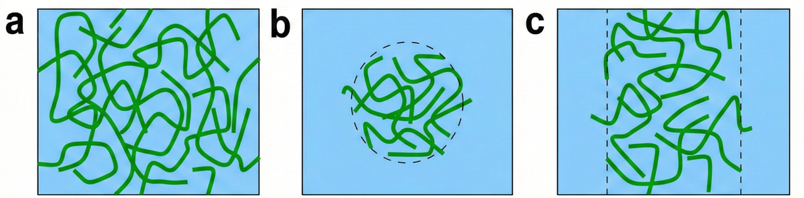
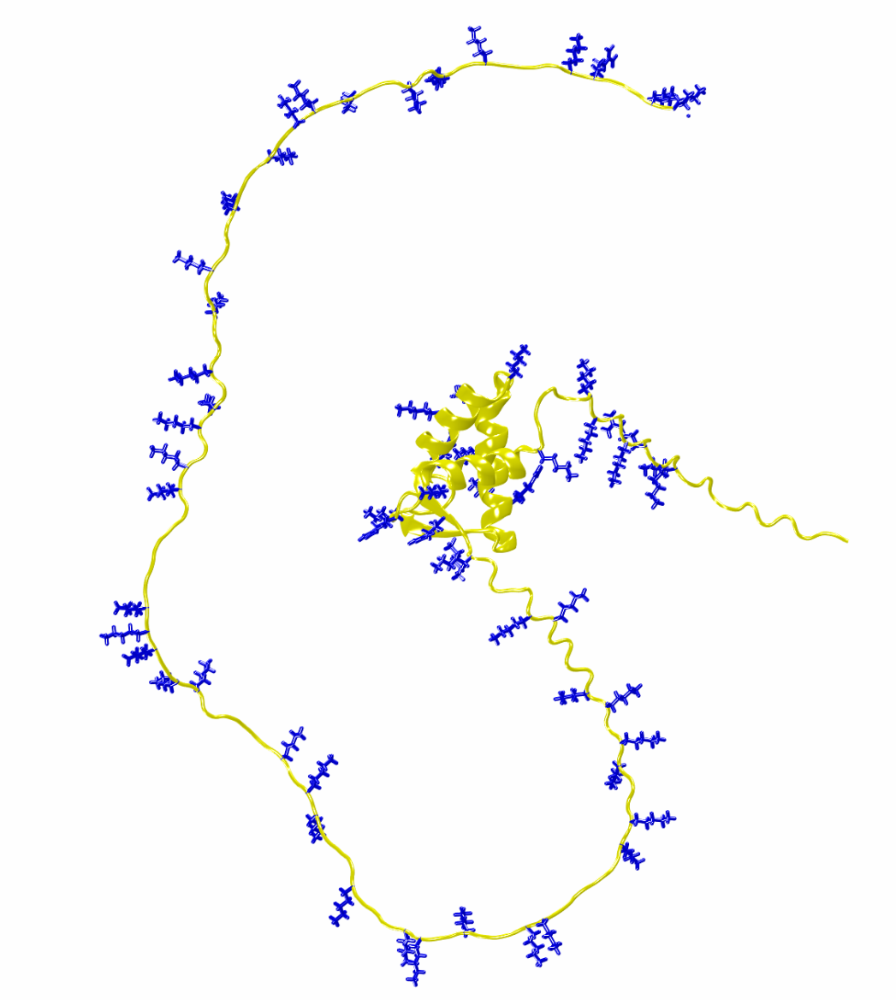
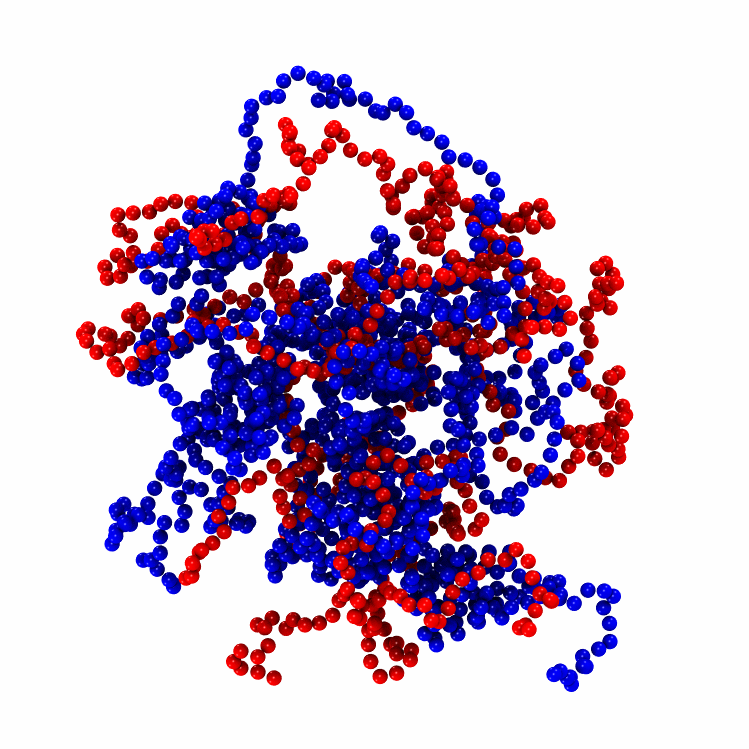
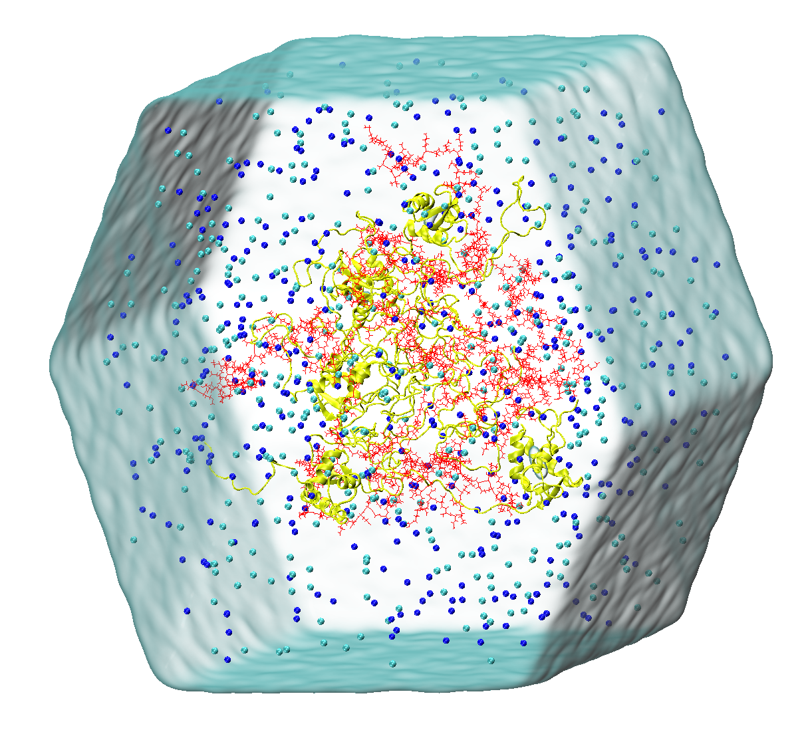
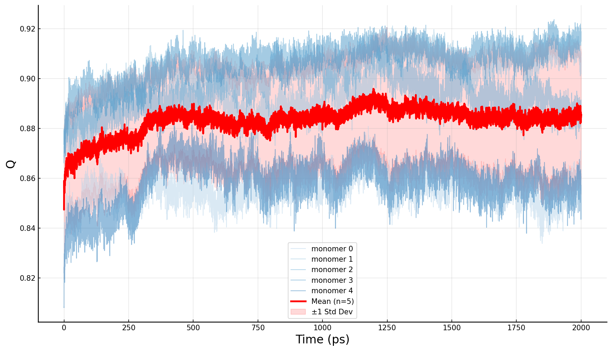
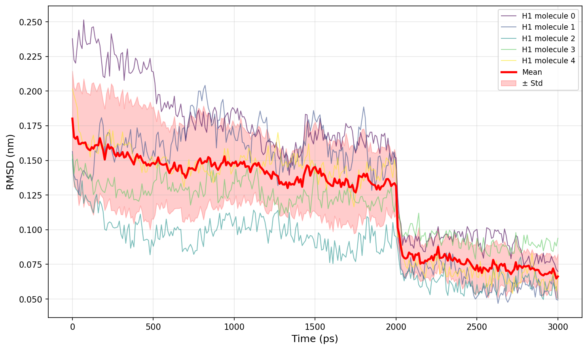
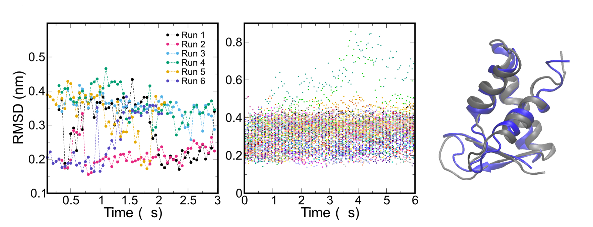

# Tutorial 2: H1 + ProTα Droplet System

This tutorial demonstrates how to use `CondenSimAdapter` to rapidly construct a phase separation system with **Histone H1** and **Prothymosin-α (ProTα)** — a classic biomolecular condensate model.

## Background

- **`Histone H1`** (Linker Histone): A highly positively charged protein that binds to nucleosomes, facilitating chromatin folding and compaction. It plays a key role in maintaining genomic structure.

- **`Prothymosin-α (ProTα)`**: A highly negatively charged intrinsically disordered protein (IDP). As a nuclear chaperone, it binds to H1 via electrostatic interactions to regulate chromatin structure and dynamics.

These proteins form a classic binding pair in the cell nucleus, interacting through strong electrostatic attraction while remaining in a highly dynamic, disordered state.

> **Key Finding**: A 2023 Nature study [1] revealed that while ProTα-H1 condensates exhibit extremely high macroscopic viscosity (~300× that of water), the molecular-scale motion of protein chains remains remarkably fast (~3× slower than in dilute solution). This "macroscopically viscous, microscopically active" characteristic challenges traditional understanding.

## Learning Objectives

1. Build multi-component systems using `CondenSimAdapter`
2. Use the `MDP` class to construct monomers with structured domains

## Workflow at a Glance

1. **Prepare inputs and directories**: set up `run` and confirm droplet geometry.
2. **Initialize configuration**: generate `H1_Prota.yaml` with `adapter init`.
3. **Define components and domains**: update IDP/MDP inputs and set H1 `fdomains`.
4. **Estimate droplet density**: use `adapter droplet-density` to choose radius and molecule counts.
5. **Run CG simulation**: execute `adapter cg` to build the droplet.
6. **Backmap and minimize**: run `adapter backmap` and `adapter minimize` with droplet-specific box options.
7. **Refine structured domain**: use Q-based CV with plumed (to be implemented).

## Step 0: Prepare Inputs

```bash
cd Tutorials/Tutorial_2_H1_ProTalpha_droplet
mkdir run
cd run
```

> **Note**: This tutorial uses droplet geometry for simulation — a near-spherical configuration.



- (a) 'Grid' geometry: Continuous dense phase with periodic boundaries in x, y, z.
- (b) 'Droplet' geometry: Protein dense phase surrounded by dilute phase.
- (c) 'Slab' geometry: Simulation with periodic boundaries in x, y and interfaces with dilute phase along z.


## Step 1: Initialize configuration with `adapter init`

First, we use `adapter init` to generate the YAML template with experimental ionic strength and temperature. For this electrostatics‑dominated system, we choose the force field optimized for electrostatic interactions: **mpipi**.

```bash
adapter init -ff mpipi --type mixed -n 1 1 -tp droplet -r 6 -t 100 -T 295 -I 0.12 --name H1_Prota
```

Example `adapter init` output:

```text
============================================================
Configuration template created successfully!
============================================================

  File: H1_Prota.yaml
  System: H1_Prota
  Force field: mpipi
  Topology: droplet - Spherical droplet confined within radius r, surrounded by dilute phase
  Radius: 6.0 nm
  Temperature: 295.0 K
  Ionic: 0.12 M
  Time: 100.0 ns (10,000,000 steps)
  Components: 2 (IDP (requires FASTA file), MDP (requires PDB file))
  Molecules per component: 1

  Next steps:
    1. Edit H1_Prota.yaml (especially fdomains for MDP components)
    2. Add your input files (FASTA/PDB) to 'input/' directory
    3. Run: adapter cg -f H1_Prota.yaml [options]
       (use 'adapter cg -h' to see available options)
```

The generated YAML is:
```yaml
# System information
system_name: H1_Prota

# CG force field
force_field: mpipi   # calvados | hps | cocomo | mpipi

# Environment parameters
radius: 6.0   # nm (droplet radius, box = [2*r, 2*r, 2*r])
box: [20.0, 20.0, 20.0]   # nm (x, y, z)
temperature: 295.0         # Kelvin
ionic: 0.12                # Molar (ionic strength)

# Topology type:
#   - grid: Continuous dense phase with periodic boundaries in x, y, z.
#   - droplet: Spherical droplet confined within radius r, surrounded by dilute phase
#   - slab: Geometry with periodic boundaries in x, y and interfaces with dilute phase along z.
topol: droplet

# CG simulation parameters
simulation:
  steps: 10000000   # 100.0 ns (1 step = 10 fs)
  wfreq: 5000        # write frequency - save per 50 ps

# Component definitions
components:
  - name: protein_A
    type: IDP          # IDP or MDP
    nmol: 1           # number of molecules (can be adjusted per component)
    ffasta: input/protein_A.fasta

  - name: protein_B
    type: MDP          # IDP or MDP
    nmol: 1           # number of molecules (can be adjusted per component)
    fpdb: input/protein_B.pdb
    # Domain definitions (required for MDP with restraints):
    fdomains: [[1, 50], [51, 100]]
```

## Step 2: Define components and MDP domains

Next, replace the placeholder names and file paths with the real inputs, and define `fdomains` for the MDP (structured domains of a multidomain protein). In the H1 case, there is only one structured domain.

```yaml
# Component definitions
components:
  - name: prota
    type: IDP          # IDP or MDP
    nmol: 1           # number of molecules (can be adjusted per component)
    ffasta: ../input/prota.fasta

  - name: H1
    type: MDP          # IDP or MDP
    nmol: 1           # number of molecules (can be adjusted per component)
    fpdb: ../input/H1.pdb
    # Domain definitions (required for MDP with restraints):
    fdomains: [[22, 96]]
```

### MDP Class

For H1, it contains a Winged Helix DNA-binding Domain as shown in the figure below.



In CondenSimAdapter, proteins containing structured regions are uniformly categorized as Multi-domain Proteins (MDP), even in cases like H1 which possesses only a single globular domain.

For such proteins, users are required to:

- **Provide the molecular structure**: This file must contain coordinates for all heavy atoms. The structure can be derived from experimental data (e.g., X-ray, NMR) or predicted using tools such as AlphaFold.

- **Define domain boundaries**: These definitions must be set prior to simulation. They can be determined based on established structural biology knowledge or inferred from the Predicted Aligned Error (PAE) matrix generated by AlphaFold.

For the defined domains, their structural integrity is generally preserved during the CG simulation, although the specific handling strategies vary across different force fields. Specifically, some force fields scale down the interaction strength of beads within the domain, while others alter the CG mapping scheme from a $C_\alpha$-based approach to a center-of-mass (COM) based representation. Despite these nuances in implementation, the relative positions of beads within a domain are typically constrained.

In CondenSimAdapter, our implementations for CALVADOS, COCOMO, and Mpipi-recharged are identical to their official counterparts. However, an exception applies to HPS-Urry. Since OpenMM does not natively support the rigid-body constraints (freezing internal coordinates) used in the original LAMMPS implementation, we have substituted this with an Elastic Network approach (ENM/ENN). Consequently, the results may differ slightly from the original HPS-Urry implementation.

## Step 3: Estimate droplet density with `adapter droplet-density`

### Droplet Density Estimation

For droplet simulations, we have designed a helper function—`adapter droplet-density`. This command helps you determine how many protein monomers to pack into a spherical droplet, or conversely, what droplet radius is appropriate for a given number of monomers.

```bash
adapter droplet-density -h
```

```text
Usage: adapter droplet-density [OPTIONS] [EXTRA_NMOL]...

  Estimate protein density in a droplet geometry.

  Calculates the protein concentration (mg/mL) based on:
      - Configuration YAML (components, sequences, residue counts)
      - Droplet radius (from -r or YAML)
      - Optional: number of molecules per component (-n flag)

  Use -n to specify molecule counts and calculate achievable density.
  Example: adapter droplet-density -f config.yaml -n 100 200

  Warnings are issued if density is below 300 mg/mL or above 800 mg/mL.

  Examples:
      adapter droplet-density -f config.yaml
      adapter droplet-density -f config.yaml -r 20 -n 10 20

Options:
  -f, --input-file PATH  Configuration YAML file  [required]
  -r, --radius FLOAT     Droplet radius in nm (defaults to value in YAML if
                         present)
  -n, --nmol TEXT        Number of molecules for each component (space-
                         separated, e.g., -n "10 20")
  -h, --help             Show this message and exit.
```

For this system, H1 monomers carry a net charge of +54, while ProTα carries a net charge of -43. A molar ratio of 5:6 generally provides good charge matching between the two components.

```bash
adapter droplet-density -f H1_Prota.yaml -r 5 -n 6 5
```

```text
============================================================
Droplet Density Estimation
============================================================

  Input:
    Configuration: H1_Prota.yaml
    Radius: 5.00 nm
    Volume: 523.60 nm³ (5.235988e-22 L)

  Composition:
    Total components: 2
    Total molecules: 11
    Total mass: 177026.17 Da (2.939657e-19 g)
    Molecule counts: User-provided via -n flag
      1. prota: 6 molecules
      2. H1: 5 molecules
    Mass calculation: Exact (from sequences)

  Density:
    561.4 mg/mL (g/L)
    ✓ Density is within recommended range (300-800 mg/mL)
```

The corresponding densities are 421.8 and 324.9 mg/mL at radii of 5.5 and 6.0 nm, respectively.

For this system, the experimentally measured protein density via Fluorescence Intensity ranges from 150-430 mg/mL, while all-atom simulations yield 290 mg/mL. We ultimately chose a radius of 6 nm with 5 H1 and 6 ProTα molecules.

## Step 4: Run CG simulation with `adapter cg`

Once the configuration is complete, similar to Tutorial 1, we execute the coarse-grained simulation using `adapter cg`:

```bash
adapter cg -f H1_Prota.yaml
```

Example CG simulation output:

```text
============================================================
CG Simulation
============================================================
  System:      H1_Prota
  Force field: mpipi
  Requested:   CUDA (GPU 0)
  Platform:    CUDA:0
  100%|██████████| 5000000/5000000 [03:00<00:00, 27708.23steps/s]

[Entanglement check]  Method: built-in Z-code PPA
  Chains analysed : 11
  Mean Z          : 0.00
  Max Z           : 0
  Fraction Z > 0  : 0.0%
  Verdict         : OK — No significant entanglement detected.

  Completed. Output: H1_Prota_CG
  Final PDB: H1_Prota_CG/final.pdb
```

This yields the final structure from the CG simulation:



> **Note on Droplet Simulation**: During the CG simulation for droplets, an additional spherical confinement potential is applied. This restricts the proteins within a defined radius, facilitating the formation of a dense phase resembling a liquid droplet.

## Step 5: Backmap and minimize (`adapter backmap` / `adapter minimize`)

Next, we proceed with the backmapping and minimization steps:

```bash
adapter backmap -f H1_Prota.yaml

adapter minimize -f H1_Prota.yaml -i H1_Prota_backmap/backmapped.pdb -ff 2 --salt-conc 0.12 --solvate -bt dodecahedron -dd 2
```

Example backmap output:

```text
No -i given; trying default: H1_Prota_CG/

============================================================
Backmapping
============================================================
  Input:      /path/to/H1_Prota_CG/final.pdb
  Model type: CalphaBasedModel
  Device:     cpu
  Topology:   droplet  (droplet centering enabled)
Loading checkpoint from: .../CalphaBasedModel-FIX.ckpt

  Completed. Output PDB: H1_Prota_backmap/backmapped.pdb
```

Example minimize output with droplet box options:

```text
============================================================
Energy Minimization
============================================================
  Input PDB:   H1_Prota_backmap/backmapped.pdb
  Force field: 2-amber03wsc
  Platform:    CUDA (GPU 0)
  HIS type:    1 — HIE (epsilon, neutral)
  System:      H1_Prota (2 component types)

  [1/4] Building GROMACS topology (amber03wsc) ...
    [prota] HIS count from FASTA: 0
    [H1] HIS count from PDB: 2
  Total HIS selections for pdb2gmx (all copies): 10
  [prota] IDP  112 residues
    PCcli generated: prota_pccli.pdb
  [H1] MDP  H1.pdb
  [2/4] Processing input structure ...
  [3/4] OpenMM softcore minimization (3 stages) ...
  [platform] Using CUDA
  Generated step1_gaussian.pdb
  Generated step2_softcore_1.pdb (lambda=0.75)
  Generated step2_softcore_2.pdb (lambda=0.85)
  Generated step2_softcore_3.pdb (lambda=0.95)
  Generated final.pdb
  Optimization: Medium (5 steps)

  Done!
  Minimization done  →  minimize_final.pdb
  Found 1 MDP component(s)
  Component 'H1': 1 domain(s), 5 copy(ies)
    Domain 0: residues 22-96, 1439 contact pairs
  Written plumed.dat to: .../H1_Prota_minimize/plumed.dat
  Successfully generated plumed.dat with 5 CONTACTMAP(s)
  plumed.dat generated  →  plumed.dat
  [4/4] Building droplet box (dodecahedron) ...
  Droplet box done  →  minimize_final_box.gro
  [4/4] Explicit solvation (tip4p2005s, 0.12 M) ...
  Solvation done  →  minimize_final_solvated.gro

  Completed. Output PDB: .../H1_Prota_minimize/minimize_final_solvated.gro
```

In the minimization command, we introduce two parameters specifically designed for droplet geometry: **`-bt`** and **`-dd`**.

These settings control the box construction and solvation process (internally utilizing `gmx editconf`). Instead of filling a large cubic box, the tool constructs a simulation box (here, a dodecahedron) that wraps the spherical droplet with a defined water shell (thickness determined by `-dd`). This strategy significantly reduces the total number of particles in the system, optimizing computational efficiency.

The resulting solvated system is illustrated below. As shown, the droplet is perfectly encased within a rhombic dodecahedron box, providing an optimal solvent buffer while significantly reducing the total volume and particle count compared to a standard cubic box




## Step 6: Using Q-based CV to refine structured domain with plumed

### Theory: Native Contact Constraints for MDPs

To prevent the disruption of folded structures in multidomain proteins (MDPs) during aggressive equilibration, CondenSimAdapter implements restraints based on the **Fraction of Native Contacts (Q)**. As a well-established collective variable for protein folding transitions [2], Q has become a standard choice for maintaining structural integrity in multiscale condensate simulations .

The order parameter Q is defined as:

$$Q = \frac{1}{N_{\text{pairs}}}\sum_{(i,j) \in \Omega} \frac{1}{1 + \exp[\beta(r_{ij} - r_{ij}^0)]}$$

where:
- $\Omega$ denotes the set of heavy atom pairs in contact in the structured domain
- $r_{ij}^0$ represents the native distance
- $\beta$ is a steepness parameter

Obviously, when Q = 1, the inter-residue contacts in the system exactly match those of the reference structure. As Q approaches 0, the native contacts are progressively lost. This indicates that, in general, the closer Q is to 1, the smaller the RMSD; conversely, the closer Q is to 0, the larger the RMSD.

CondenSimAdapter automates the construction of these restraints by generating PLUMED-compatible CV definitions, enabling biased simulations to better preserve the native structures of the structured domains during equilibration.

### Practical Implementation

When running `adapter minimize` on a system containing MDPs, a `plumed.dat` file is automatically generated. It defines a number of CVs equal to `nmol * n_domain_per_mol`, and applies a harmonic potential with a reference value of 1 to restrain the Q value.

The generated `plumed.dat` file uses the `CONTACTMAP` collective variable to define native contacts for each domain in the system. Each contact is weighted and summed to produce the overall Q value for that domain. Here is an example of the generated file:

```plumed
plumed.dat
CONTACTMAP  ...
ATOMS1=9642,9666   SWITCH1={Q R_0=0.01 BETA=20 LAMBDA=1.5 REF=0.41490840288923303 } WEIGHT1=0.0006949270326615705
ATOMS2=9644,9682   SWITCH2={Q R_0=0.01 BETA=20 LAMBDA=1.5 REF=0.4172685186026254 } WEIGHT2=0.0006949270326615705
ATOMS3=9644,9676   SWITCH3={Q R_0=0.01 BETA=20 LAMBDA=1.5 REF=0.37585368043641804 } WEIGHT3=0.0006949270326615705
ATOMS4=9644,9674   SWITCH4={Q R_0=0.01 BETA=20 LAMBDA=1.5 REF=0.41246096221234085 } WEIGHT4=0.0006949270326615705
ATOMS5=9644,9673   SWITCH5={Q R_0=0.01 BETA=20 LAMBDA=1.5 REF=0.4147203629696675 } WEIGHT5=0.0006949270326615705

......

ATOMS1437=23282,23294 SWITCH1437={Q R_0=0.01 BETA=20 LAMBDA=1.5 REF=0.3478549610854117 } WEIGHT1437=0.0006949270326615705
ATOMS1438=23283,23296 SWITCH1438={Q R_0=0.01 BETA=20 LAMBDA=1.5 REF=0.43487350922387275 } WEIGHT1438=0.0006949270326615705
ATOMS1439=23283,23294 SWITCH1439={Q R_0=0.01 BETA=20 LAMBDA=1.5 REF=0.31462671559973643 } WEIGHT1439=0.0006949270326615705
LABEL=Q4
SUM
... CONTACTMAP

PRINT ARG=Q4 FILE=COLVAR4

RESTRAINT ARG=Q0 AT=1.0 KAPPA=10000 SLOPE=0.
RESTRAINT ARG=Q1 AT=1.0 KAPPA=10000 SLOPE=0.
RESTRAINT ARG=Q2 AT=1.0 KAPPA=10000 SLOPE=0.
RESTRAINT ARG=Q3 AT=1.0 KAPPA=10000 SLOPE=0.
RESTRAINT ARG=Q4 AT=1.0 KAPPA=10000 SLOPE=0.
```

In this example:
- `CONTACTMAP` defines the native contacts with atom indices, switch functions, and reference values
- Each `Q0-Q4` represents the fraction of native contacts for first domains(each H1 monomer have one structured domain)
- `RESTRAINT` applies harmonic potentials with force constant `KAPPA=10000` to keep Q values close to 1 (the native state)

With the generated `plumed.dat` file, we can now run Q-based CV biased simulations using GROMACS patched with PLUMED. First, we perform energy minimization—this step does not require PLUMED. Next, we use an equilibration MD parameter file (NVT or NPT) to generate the tpr file for the equilibration phase. For example, the built-in `pr_plumed.mdp` in the `input` folder defines a 2 ns equilibration run at 300 K and 1 bar in the NPT ensemble. Run the following command to generate the tpr file:

```bash
gmx grompp -f pr_plumed.mdp -c em_cg.gro -p topol.top -o pr_plumed.tpr
```

Then, run `mdrun` to execute the Q-based biased simulation:

```bash
gmx mdrun -deffnm pr_plumed -plumed plumed.dat
```

Running this simulation requires a PLUMED-patched GROMACS. The simplest way is to compile GROMACS with `-DGMX_USE_PLUMED=ON` in version 2025 or later. For manual installation, please refer to the [PLUMED installation guide](https://www.plumed.org/doc-v2.10/user-doc/html/_installation.html).

This run will generate `COLVAR{n}` files, which record the value of each collective variable over simulation time. For our case, there are 5 COLVAR files. The plot of all 5 CVs is shown below:



As shown in the plot, for our system, the average Q values stabilize after the simulation time exceeds 1 ns.

We also examined the backbone RMSD of the structured domains for the five H1 monomers in our system. Between 2-3 ns, we increased `KAPPA` from `10000` to `200000` to enhance the structural restraint. The RMSD of the system is shown below.



As shown in the plot, with our default `KAPPA` value (0-2 ns), the RMSD of the system steadily decreases and finally stabilizes at around 0.15 nm. This is very similar to the RMSD behavior of this domain in condensates reported in Ref. [1] (minimum RMSD between 0.15-0.2 nm over 6 μs). When `KAPPA` is increased to 200000, the RMSD decreases more rapidly, with the Q value reaching approximately 0.97.



In practical applications, users can manually adjust the `KAPPA` value based on how much they want to restrain the system during the equilibration phase. Of course, considering that protein structured domains, especially their loop regions, are inherently flexible, a `KAPPA` value in the range of 1000-10000 is generally recommended.


## Reference

[1] **Extreme dynamics in a biomolecular condensate**  N. Galvanetto, M.T. Ivanović, A. Chowdhury, et al.  *Nature* **619**, 876–883 (2023)  DOI: [10.1038/s41586-023-06329-5](https://doi.org/10.1038/s41586-023-06329-5)

[2] **Native contacts determine protein folding mechanisms in atomistic simulations** R. B. Best, G. Hummer, W. A. Eaton. *Proc. Natl. Acad. Sci.* **110**, 17874–17879 (2013) DOI: [10.1073/pnas.1311599110](https://doi.org/10.1073/pnas.1311599110)
